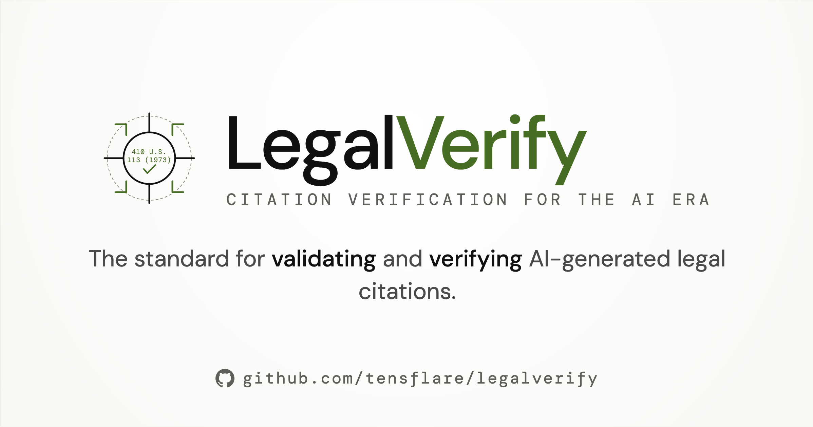

# LegalVerify

**Citation verification for the AI era** — check whether legal citations exist and are still good law.

<div align="center">
  
</div>

```
npx legalverify verify brief.txt
```

## Scope

> LegalVerify verifies citation **existence** (does this source exist?). It does **not** verify proposition accuracy (does this source say what was claimed?). Attorneys remain independently responsible for proposition review.

This distinction is the product's liability boundary. See [SCOPE.md](SCOPE.md) for full documentation.

## Quick Start

```bash
npm install -g legalverify

echo "The Court held in Roe v. Wade, 410 U.S. 113 (1973)..." | legalverify verify

# Or from a file
legalverify verify brief.txt --json --output report.json

# Compliance check
legalverify verify brief.txt --json | legalverify compliance --standard ny-part-161

# Start the web UI + API
legalverify serve
# → http://localhost:3579
```

## CLI

| Command | Description |
|---------|-------------|
| `verify [file]` | Verify citations in a document (stdin or file) |
| `compliance [file]` | Generate compliance report from verification JSON |
| `coverage` | Show source coverage map |
| `serve` | Start the API server + web UI |
| `mcp` | Start the MCP protocol server (stdio) |

### Options

- `verify --json` — raw JSON output
- `verify --brief` — suppress scope notice
- `verify -o report.json` — write report to file
- `compliance -s ny-part-161` — compliance standard

## API

```
POST /verify              Verify citations in text
POST /compliance          Generate compliance report
POST /verify-and-comply   Both in one call
GET  /health              Server health
GET  /coverage            Source coverage map
GET  /stats               Citation index statistics
POST /auth/magic/request  Request magic link
POST /auth/magic/verify   Verify magic link
POST /auth/keys           Create API key (auth required)
GET  /auth/keys           List API keys (auth required)
```

### Example

```bash
curl -X POST http://localhost:3579/verify \
  -H "Content-Type: application/json" \
  -d '{"text": "See Roe v. Wade, 410 U.S. 113 (1973)"}'
```

## Web UI


Paste legal text, click "Verify Citations". Optional NY Part 161 compliance check. Dark theme, zero dependencies.

## MCP Protocol

Integrate with AI assistants via the [Model Context Protocol](https://modelcontextprotocol.io):

```bash
legalverify mcp
```

Tools: `verify_citations`, `check_compliance`, `get_coverage`.

## Coverage

| Source | Jurisdictions | Coverage | Confidence |
|--------|--------------|----------|------------|
| CourtListener | US (all 50 states + federal) | Partial (daily) | 95% |
| Harvard CAP | US (all 50 states + federal) | Partial (through Jun 2018) | 98% |
| Google Scholar | US, AU, CA, UK | Limited (fallback) | 70% |
| Local Corpus | User-defined | User-defined | 85% |

Citations outside coverage return `UNVERIFIED`, not `VERIFIED`. Run `legalverify coverage` for full details.

## Compliance

### NY Part 161 (effective June 1, 2026)

```bash
legalverify verify brief.json --json | legalverify compliance --standard ny-part-161
```

New York Rules of the Chief Administrative Judge Part 161 require AI-assisted court filings to disclose AI use and verify citations. LegalVerify automates the citation verification workflow.

## Auth

- **Magic link**: `POST /auth/magic/request` → email → `POST /auth/magic/verify` → JWT
- **Google OAuth**: `GET /auth/google` → consent → callback → JWT
- **API keys**: `POST /auth/keys` → `lv_xxx` key — use via `Authorization: Bearer lv_xxx`

Anonymous verification is always free and rate-limited.

## Development

```bash
git clone https://github.com/tensflare/verify
cd verify

npm install
npm run dev          # CLI via tsx
npm run dev:web      # API server via tsx
npm test             # 150+ tests
npm run typecheck    # Zero errors
```

### Project Structure

```
src/
  verify/       parser, resolver, coverage, scope
  sources/      CourtListener, CAP, Google Scholar, Local Corpus
  auth/         magic link, API keys, Google OAuth, middleware
  compliance/   NY Part 161, generic rulesets
  store/        SQLite store, Store interface
  api/          Express server
  mcp/          MCP protocol server
  web/public/   Vanilla HTML/CSS/JS web UI
```

## Architecture

```
┌─────────────┐     ┌──────────────┐     ┌─────────────────┐
│  CLI / API  │────▶│  Resolver    │────▶│  CourtListener  │
│  / Web UI   │     │  (fallback   │     │  CAP            │
│  / MCP      │     │   chain)     │     │  Google Scholar │
└─────────────┘     └──────┬───────┘     │  Local Corpus   │
                           │             └─────────────────┘
                    ┌──────▼───────┐
                    │  Coverage    │
                    │  Check       │
                    └──────┬───────┘
                    ┌──────▼───────┐
                    │  Compliance  │
                    │  Engine      │
                    └──────────────┘
```

## Why Not Just Use Westlaw/Lexis?

- **Automated**: API-first, no manual entry
- **Multi-source**: Aggregates CourtListener, CAP, Google Scholar, local corpus
- **Auditable**: Every verification has a source trail
- **Local-first**: Document text never leaves your environment
- **Open source**: Apache 2.0, community extensible

## Related Projects

- [HalluCase](https://github.com/tensflare/hallucase) — Legal hallucination incident registry (CVE-style)
- [MCP-Law](https://github.com/tensflare/mcp-law) — Legal MCP server scaffolder
- [Duct](https://github.com/docfide/duct) — Document RAG pipeline
- [Glawly](https://glawly.com) — AI operating system for law firms

## License

Apache 2.0 © [Tensflare Inc.](https://tensflare.com)
